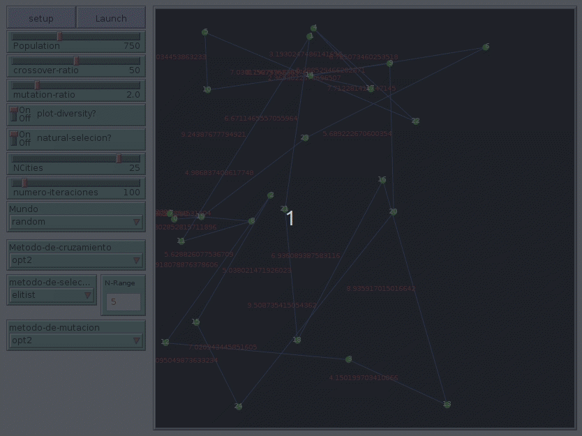
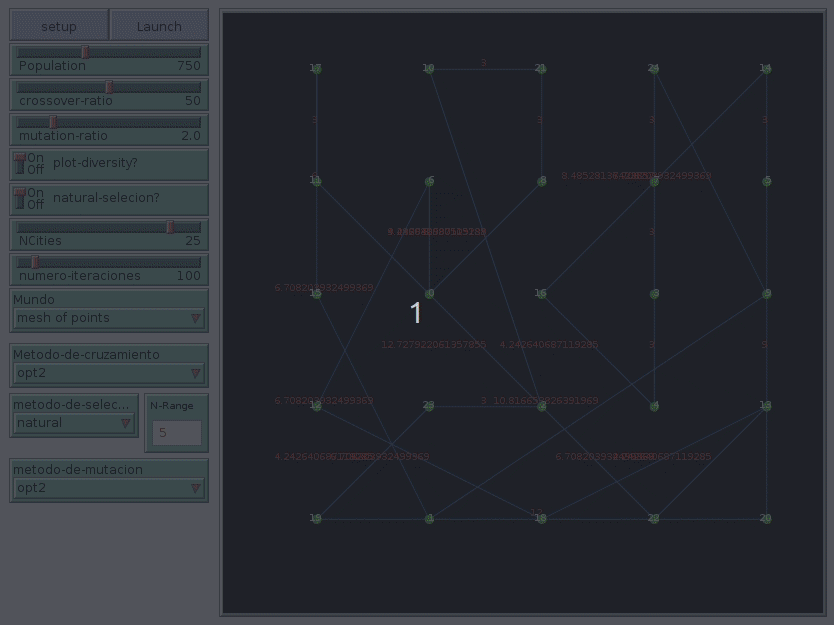

# Problema del viajante (TSP)

En el **Problema del Viajante - TSP (Travelling Salesman Problem)**, el objetivo es encontrar un recorrido completo que conecte todos los nodos de una red, visitándolos tan solo una vez y volviendo al punto de partida, y que además minimice la distancia total de la ruta, o el tiempo total del recorrido.

# ¿Qué es un algoritmo genético?

Un algoritmo genético (AG) es una técnica de resolución de problemas que imita a la evolución biológica como estrategia para resolver problemas, englobándose dentro de lo que antes hemos denominado técnicas basadas en poblaciones. Dado un problema específico a resolver, la entrada del AG es un conjunto de soluciones potenciales a ese problema, codificadas de alguna manera, y una métrica llamada función de aptitud, o fitness, que permite evaluar cuantitativamente a cada solución candidata. Estas candidatas pueden ser soluciones que ya se sabe que funcionan, con el objetivo de que el AG las mejore, pero se suelen generar aleatoriamente.

A partir de ahí, AG evalúa cada candidata de acuerdo con la función de aptitud. Por supuesto, se debe tener en cuenta que estas primeras candidatas generadas aleatoriamente, tendrán una eficiencia mínima con respecto a la resolución del problema, y la mayoría no funcionarán en absoluto. Sin embargo, por puro azar, unas pocas pueden ser prometedoras, pudiendo mostrar algunas características que muestren, aunque sólo sea de una froma débil e imperfecta, cierta capacidad de  solución del problema.

Estas candidatas prometedoras se conservan y se les permite reproducirse. Se realizan múltiples copias de ellas, pero estas copias no son perfectas, sino que se les introducen algunos cambios aleatorios durante el proceso de copia, a modo de las mutaciones que pueden sufrir los descendientes de una población. Luego, esta descendencia digital prosigue con la siguiente generación, formando un nuevo conjunto de soluciones candidatas, y son de nuevo sometidas a una ronda de evaluación de aptitud. Las candidatas que han empeorado o no han mejorado con los cambios en su código son eliminadas de nuevo; pero, de nuevo, por puro azar, las variaciones aleatorias introducidas en la población pueden haber mejorado a algunos individuos, convirtiéndolos en mejores soluciones del problema, más completas o más eficientes. El proceso se repite las iteraciones que haga falta, hasta que obtengamos soluciones suficientemente buenas para nuestros propósitos.

# ¿Como se usa?

1. Se crea una población aleatoria de soluciones. Cada solución está formada por una lista aleatoria de números diferentes de 0 a N sin repetirse, donde N es el número de ciudades. 

   -  **`AI:Initial-Population [#population]`**: realiza el paso 1.
   - **`#population`**: Población (número) de individuos que tendrá cada generación.

2. Cada solución se evalúa en en función de lo bien que resuelve el problema. Esta medida de la “bondad” de la solución se llama “fitness”. 

   - **`AI:Compute-fitness`**: calcula el valor del fitness según el contenido del individuo de la siguiente forma:

     $$
     fitness(d) = -1*(R1 + R2)  =-1*( \sum d_i + (N - sizeof(d)) * 100)
     $$

     - R1 es el sumatorio de las distancias euclídeas entre las ciudades del individuo d.
     - R2 es la penalización en función del tamaño de la lista del individuo d, que será mayor cuanto mayor sea la diferencia entre el numero total de ciudades y el numero de ciudades del individuo.
     - El -1 se usa porque es una función de minimización, ya que buscamos el camino de menor distancia.
     
   -  **`fitness`**: variable que almacena el valor de Fitness del individuo.

   - **`content`** : variable que almacena el contenido (valor) del estado.

3. Se crea una generación nueva de soluciones a partir de la generación anterior, donde aquellas soluciones que tengan un fitness más alto tienen más probabilidad de ser escogidos como padres de las nuevas soluciones.  

   - 3.1) El método de selección usado en el modelo es el de torneo de tamaño 3, lo que significa que se toman aleatoriamente 3 soluciones de la generación anterior, y de entre ellos se toma el que tenga mejor fitness para ser uno de los padres de la siguiente generación.  Pero este modelo emplea un aditivo  que consiste en eliminar a individuos similares para mantener la diversidad y evitar la que se conoce como (immature convergence) convergencia prematura, que es uno de los problemas más conocidos en AG. 
   
     - **`AI:Select-torneo[#old-generation]`**:  método que realiza la selección por torneo.
     - **`aquí_va_la_explicación_del_método_de_selección`** 
   
   - 3.2) Una vez que la selección ha elegido a los individuos aptos, éstos deben ser alterados aleatoriamente con la esperanza de mejorar su aptitud para la siguiente generación. Existen dos estrategias básicas para realizar esta tarea:
   
     - La primera y más sencilla es la que se conoce como **mutación**. Al igual que una mutación en los seres vivos cambia un gen por otro, una mutación en un algoritmo genético también causa pequeñas alteraciones en puntos concretos de la codificación del individuo.
   
       - **`#mutation-ratio`** : probabilidad de mutación de cada unidad informativa del ADN de los individuos
   
     - El segundo método se llama **cruzamiento**, y consiste en seleccionar a dos individuos para que intercambien segmentos de su código genético, produciendo una "descendencia" artificial cuyos individuos son combinaciones de sus padres. Aquí es donde entra en juego el método de cruzamiento opt-2 que se explica a continuación: 
   
       - **TODA ESTE PUNTO HAY QUE ELIMINARLO SI NO SE PROGAMA EL METODO OPT2**           El **método 2opt** es uno de los algoritmos de búsqueda local más conocidos entre los algoritmos de resolución de TSP. Mejora la ronda de arista a arista e invierte el orden del subtour. Por ejemplo, imagine un recorrido como el que se muestra en la parte superior de la Fig.1. Quitar las dos aristas ab y cd, e invertir el orden del subtour (de b a c), y añadir las dos aristas ac y bd. Esto nos da un recorrido como se muestra en la parte inferior de la Fig. 1. El tour inferior es más corto que el superior porque ab + cd > ac + bd.
   
         
Comprobamos cada par de aristas, por ejemplo, ab y cd. Si ab + cd > ac + bd se mantiene, los mejoramos de la misma manera que se muestra en la Fig. 1. En realidad, si tanto ac > ab como bd > cd se mantienen, entonces no es necesario comprobar las aristas. Por lo tanto, podemos saltarnos los pares cuyas aristas estén muy alejadas entre sí.
   
   - 3.3) Repetimos los procedimientos descritos anteriormente hasta que no se puedan hacer más mejoras.
   
     - **`AI:Crossover-opt2 [c1 c2]`**: Este método realiza un cruzamiento del contenido de los individuos que se le pasan como entrada , para explicar el cruzamiento nos apoyaremos en la siguiente figura:
   
           Supongamos que los cromosomas de los padres son ***ga* = (D; H; B; A; C; F; G; E) *y* *gb* = (*B;* C; D; G; H; F; E; A)**. Primero, elije una ciudad al azar. En este ejemplo, se elige la ciudad C. Entonces x = *4*  e  *y* = *1*  porque  *a4*  *=* C y *b1* = C respectivamente. Ahora el hijo *es (**C**).*
   
           Luego, recoja las ciudades de los padres alternativamente. Comience con *a3*  (ciudad A) porque x =4 - 1= 3,  y luego *b2* (ciudad D) porque y= 1 + 1= 2.  El hijo se convierte en g = (**A; C; D**).
   
           De la misma manera, se agrega *a2*  (ciudad  B), *b3* (ciudad G),  *a1* (ciudad  H),  y el hijo se convierte en  g = (**H; B; A; C; D; G**).  Ahora la siguiente ciudad es *b4* = H  y la ciudad H ya ha aparecido en el hijo (recuerde que el vendedor no puede visitar la misma ciudad dos veces), así que no podemos añadir más ciudades del padre gb.
   
           Por lo tanto, añadiremos ciudades del padre ga. La siguiente ciudad es a0  = D, pero D ya se usa. Por lo tanto, tampoco podemos añadir ciudades  del padre ga.
   
           Después, añadimos el resto de las ciudades, es decir, E y F, al hijo en el orden aleatorio. Finalmente el hijo es g = (**H; B; A; C; D; G; F; E**).
         
     - **`#crossover-ratio`** : % de cruzamientos que se harán en cada iteración
   
4. Los pasos 2 y 3 anteriores se repiten hasta llegar a un número de iteraciones, y el individuo que se da como resultado es el de la última iteración;

   - **`#num-iters`** : Número de iteraciones (generaciones) que dará el algoritmo

Por otro lado, para la posible representación es necesario la implementación de:

- **`AI:ExternalUpdate`** : Procedimiento auxiliar que se ejecutará tras cada iteración del bucle principal. Contiene instrucciones para mostrar y actualizar información del modelo.
- **`setupWorld.nls`**: Archivo que contiene código de algunos modelos de ejemplo para representar posibles recorridos del viajante y poder calcular mediante el algoritmo el camino óptimo que debería realizar el viajante.

# Ejemplo 1: Mundo aleatorio, metodo de selección elitista

# Ejemplo 2: Mundo en malla de puntos, metodo de selección natural

# Bibliografía

http://www.cs.us.es/~fsancho/?e=104